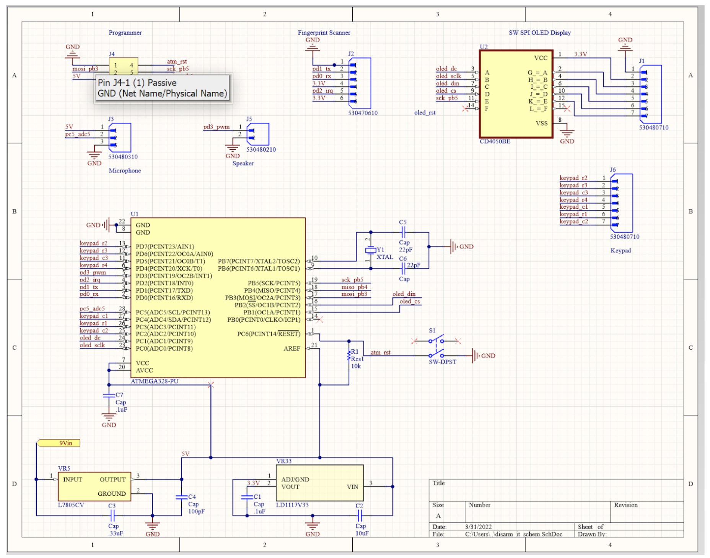
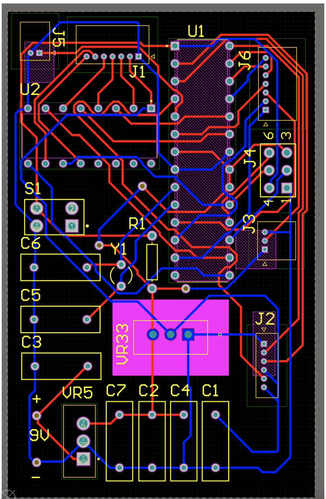
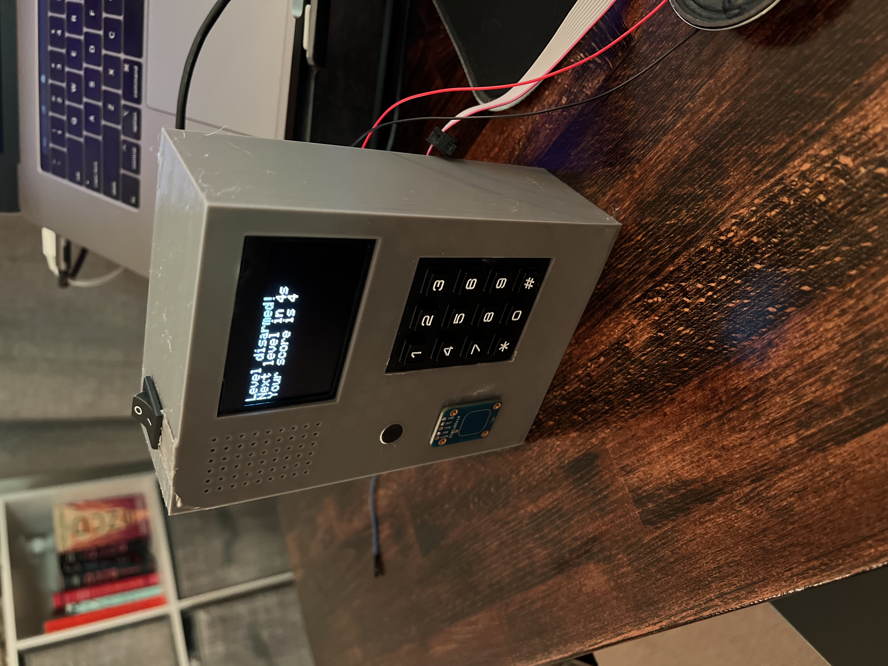

# Disarm-It!
This project is based off the popular game Bop-It! 
In our version, we have three inputs:
- Scan it!
- Unlock it!
- Password it!

The software folder contains all of the arduino files, the pcb folder has all PCB files and the enclosure folder has all fusion360 files for the enclosure.

To achieve this, we created a PCB and 3D printed enclosure to go with the game. Enclosure design was done in Fusion360 and the PCB was design in Altium. 

# The PCB:

# The enclosure:

# Demo
https://www.youtube.com/watch?v=G1TUeg5arFM

# Contributers
Peri Hassanzadeh, Liam Neary, Shane Raible
